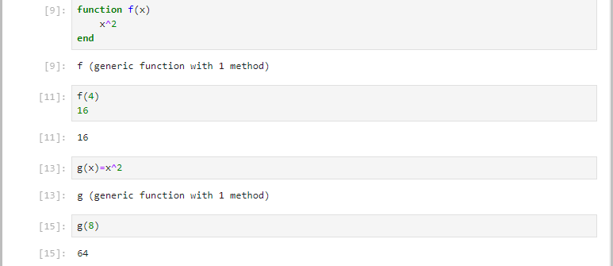
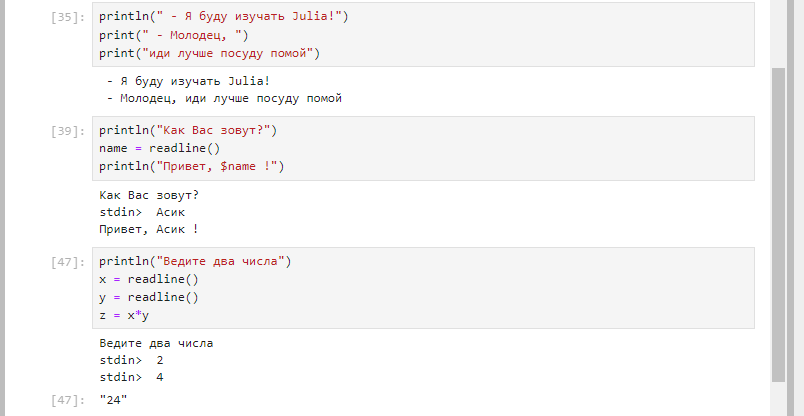
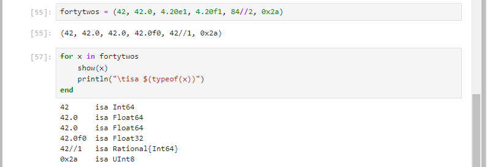

---
# Front matter
# Front matter
lang: ru-RU
title: "Компьютерный практикум по статистическому анализу данных"
subtitle: "Лабораторная работа №3: Управляющие структуры"
author: "Кармацкий Никита Сергеевич"
institute:
  - Российский университет дружбы народов, Москва, Россия

# i18n babel
babel-lang: russian
babel-otherlangs: english

# Formatting pdf
toc: false
toc-title: Содержание
slide_level: 2
aspectratio: 169
section-titles: true
theme: metropolis
header-includes:
 - \metroset{progressbar=frametitle,sectionpage=progressbar,numbering=fraction}
 - '\makeatletter'
 - '\beamer@ignorenonframefalse'
 - '\makeatother'
---
# Цель работы

Основная цель работы — подготовить рабочее пространство и инструментарий для
работы с языком программирования Julia, на простейших примерах познакомиться
с основами синтаксиса Julia.

# Выполнение лабораторной работы

## Основы работы в блокноте Jupyter

Пример

## Основы синтаксиса Julia на примерах

Простейшие примеры с использованием синтаксиса

## Примеры приведения аргументов к одному типу

Пример

Пример 

## Изучил документацию по основным функциям Julia.

## Изучиk синтаксис Julia для базовых математических операций

# Вывод

Подготовил рабочее пространство и инструментарий для
работы с языком программирования Julia, на простейших примерах познакомился
с основами синтаксиса Julia.

# Список литературы. Библиография

[1] Mininet: https://mininet.org/
