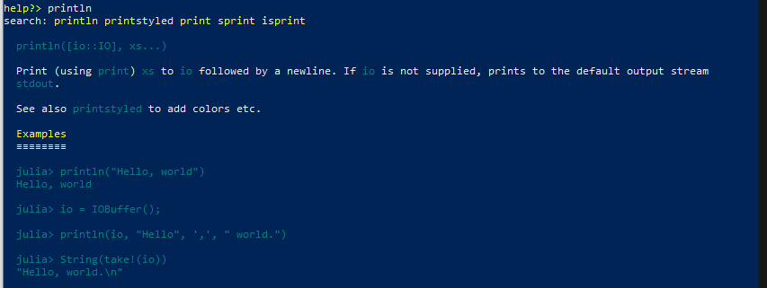
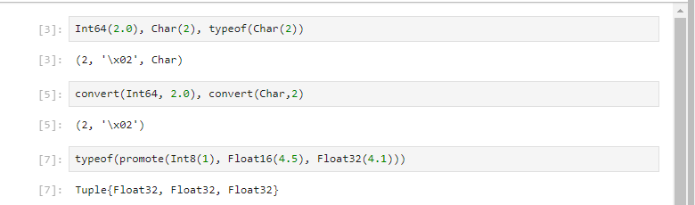
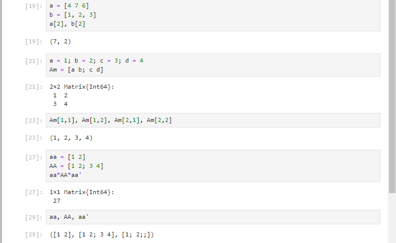
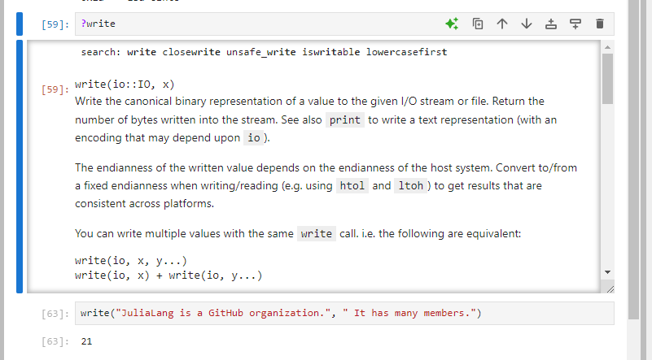

---
## Front matter
title: "Компьютерный практикум по статистическому анализу данных"
subtitle: "Отчёт по лабораторной работе №1: Установка и настройка. Основные принципы"
author: "Ахлиддинзода Аслиддин"

## Generic otions
lang: ru-RU
toc-title: "Содержание"

## Bibliography
bibliography: bib/cite.bib
csl: pandoc/csl/gost-r-7-0-5-2008-numeric.csl

## Pdf output format
toc: true # Table of contents
toc-depth: 2
lof: true # List of figures
lot: true # List of tables
fontsize: 12pt
linestretch: 1.5
papersize: a4
documentclass: scrreprt
## I18n polyglossia
polyglossia-lang:
  name: russian
  options:
  - spelling=modern
  - babelshorthands=true
polyglossia-otherlangs:
  name: english
## I18n babel
babel-lang: russian
babel-otherlangs: english
## Fonts
mainfont: PT Serif
romanfont: PT Serif
sansfont: PT Sans
monofont: PT Mono
mainfontoptions: Ligatures=TeX
romanfontoptions: Ligatures=TeX
sansfontoptions: Ligatures=TeX,Scale=MatchLowercase
monofontoptions: Scale=MatchLowercase,Scale=0.9
## Biblatex
biblatex: true
biblio-style: "gost-numeric"
biblatexoptions:
  - parentracker=true
  - backend=biber
  - hyperref=auto
  - language=auto
  - autolang=other*
  - citestyle=gost-numeric
## Pandoc-crossref LaTeX customization
figureTitle: "Рис."
tableTitle: "Таблица"
listingTitle: "Листинг"
lolTitle: "Листинги"
## Misc options
indent: true
header-includes:
  - \usepackage{indentfirst}
  - \usepackage{float} # keep figures where there are in the text
  - \floatplacement{figure}{H} # keep figures where there are in the text
---
# Цель работы

Основная цель работы — подготовить рабочее пространство и инструментарий для
работы с языком программирования Julia, на простейших примерах познакомиться
с основами синтаксиса Julia.

# Выполнение лабораторной работы

## Основы работы в блокноте Jupyter

Пример

## Основы синтаксиса Julia на примерах

Простейшие примеры с использованием синтаксиса

## Примеры приведения аргументов к одному типу

Пример

Пример 

## Изучил документацию по основным функциям Julia.

## Изучиk синтаксис Julia для базовых математических операций

# Вывод

Подготовил рабочее пространство и инструментарий для
работы с языком программирования Julia, на простейших примерах познакомился
с основами синтаксиса Julia.

# Список литературы. Библиография

[1] Mininet: https://mininet.org/
