---
## Front matter
lang: ru-RU
title: Структура научной презентации
subtitle: Простейший шаблон
author:
  - Ахлиддинзода Аслидин
institute:
  - Российский университет дружбы народов, Москва, Россия
  - Объединённый институт ядерных исследований, Дубна, Россия
date: 01 января 1970

## i18n babel
babel-lang: russian
babel-otherlangs: english

## Formatting pdf
toc: false
toc-title: Содержание
slide_level: 2
aspectratio: 169
section-titles: true
theme: metropolis
header-includes:
 - \metroset{progressbar=frametitle,sectionpage=progressbar,numbering=fraction}
---

# Цель работы

Основная цель работы — изучить несколько структур данных, реализованных в Julia,
научиться применять их и операции над ними для решения задач.

# Выполнение лабораторной работы

##  Кортежи

Синтаксис определения кортежа

## Словари

Примеры словарей и операций над ними:

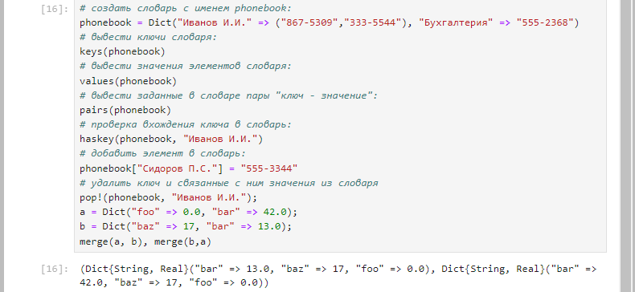

##  Множества

Примеры множеств и операций над ними:

##  Массивы

Примеры массивов:

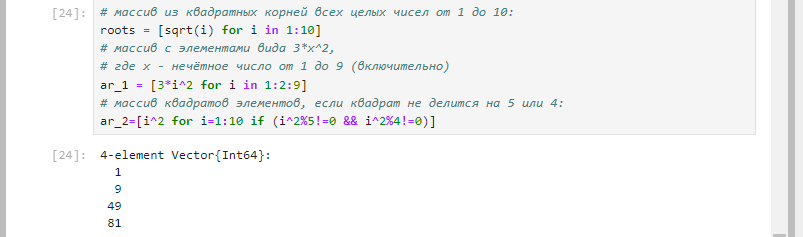

##  Задания для самостоятельного выполнения

Решим пример

Приведите свои примеры с выполнением операций над множествами элементов
разных типов.

Решим пример

Решим пример

Решим пример

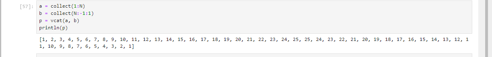

Решим пример

Решим пример

Решим пример

Решим пример

Решим пример

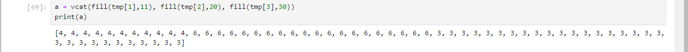

Решим пример

Решим пример

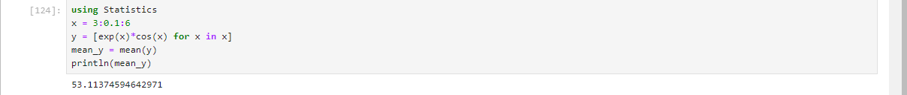

Решим пример

Решим пример

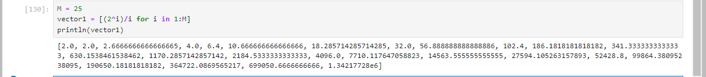

Решим пример

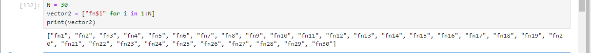

Решим пример

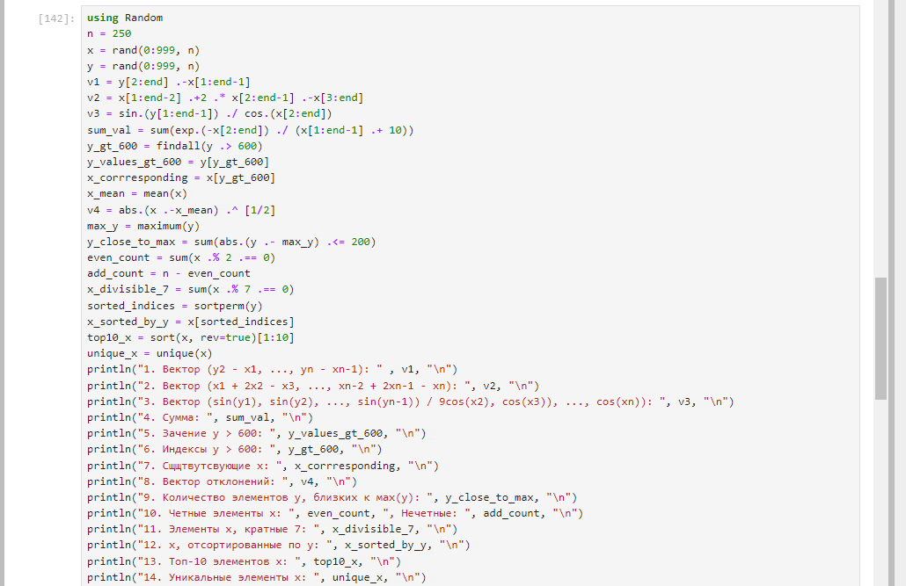

Решим пример

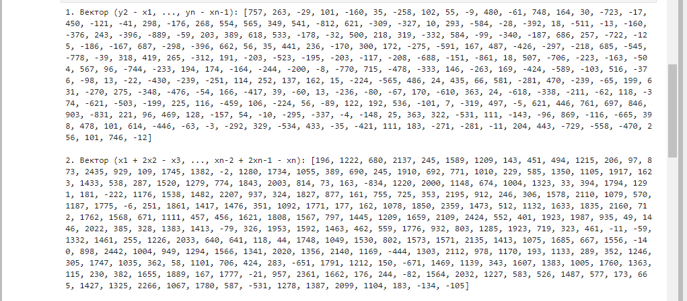

Решим пример

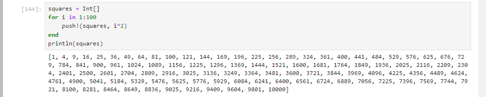

Решим пример

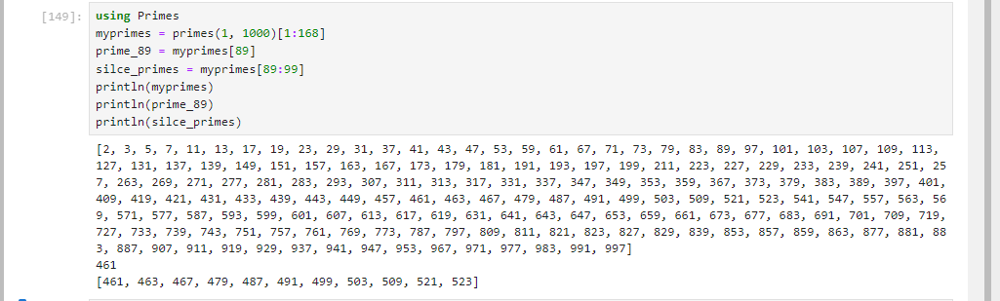

Решим пример

Решим пример

Решим пример

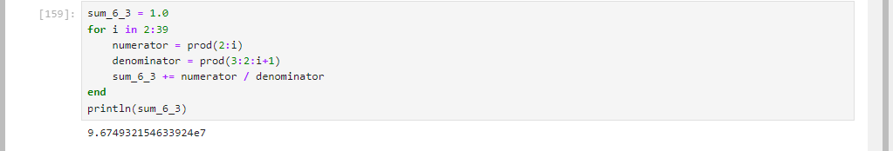

# Вывод

Изучил несколько структур данных, реализованных в Julia,
научился применять их и операции над ними для решения задач.

# Список литературы. Библиография

[1] Mininet: https://mininet.org/
