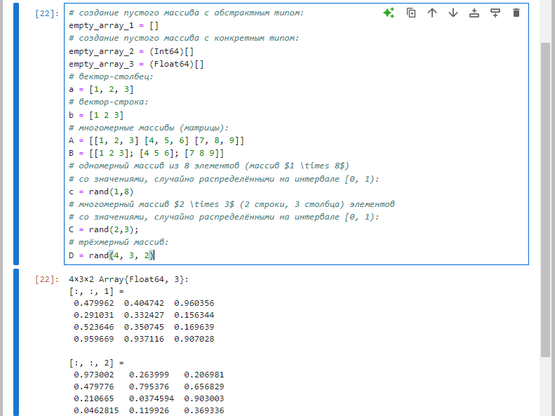
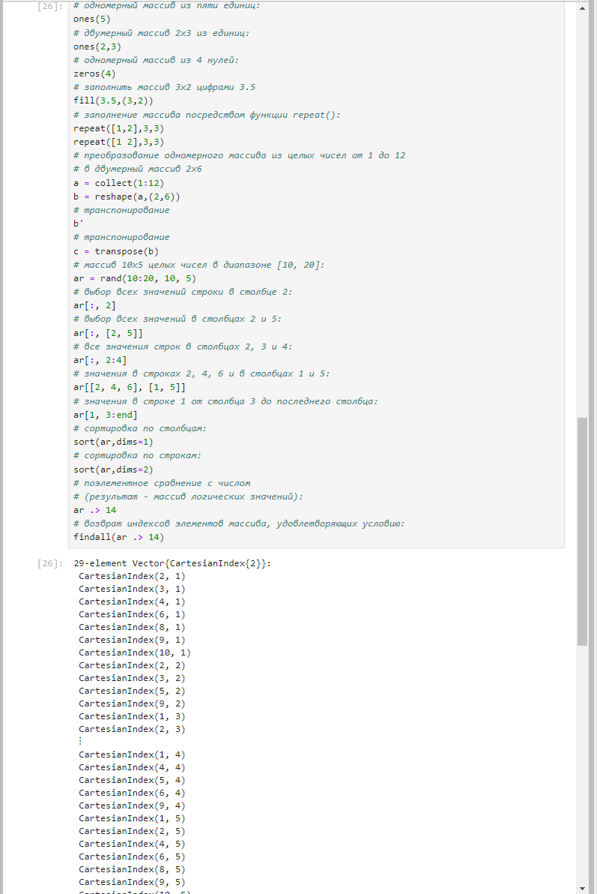
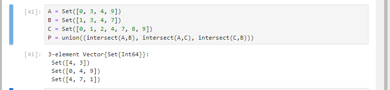
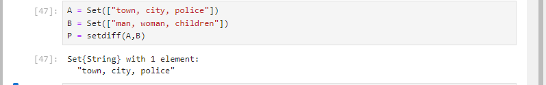
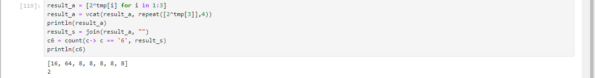
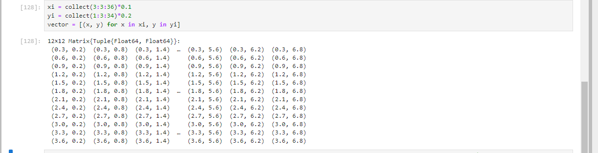

---
## Front matter
title: "Шаблон отчёта по лабораторной работе"
subtitle: "Выполнение отчета к лабораторной работе 2"
author: "Ахлиддинзода Аслиддин"

## Generic otions
lang: ru-RU
toc-title: "Содержание"

## Bibliography
bibliography: bib/cite.bib
csl: pandoc/csl/gost-r-7-0-5-2008-numeric.csl

## Pdf output format
toc: true # Table of contents
toc-depth: 2
lof: true # List of figures
lot: true # List of tables
fontsize: 12pt
linestretch: 1.5
papersize: a4
documentclass: scrreprt
## I18n polyglossia
polyglossia-lang:
  name: russian
  options:
	- spelling=modern
	- babelshorthands=true
polyglossia-otherlangs:
  name: english
## I18n babel
babel-lang: russian
babel-otherlangs: english
## Fonts
mainfont: IBM Plex Serif
romanfont: IBM Plex Serif
sansfont: IBM Plex Sans
monofont: IBM Plex Mono
mathfont: STIX Two Math
mainfontoptions: Ligatures=Common,Ligatures=TeX,Scale=0.94
romanfontoptions: Ligatures=Common,Ligatures=TeX,Scale=0.94
sansfontoptions: Ligatures=Common,Ligatures=TeX,Scale=MatchLowercase,Scale=0.94
monofontoptions: Scale=MatchLowercase,Scale=0.94,FakeStretch=0.9
mathfontoptions:
## Biblatex
biblatex: true
biblio-style: "gost-numeric"
biblatexoptions:
  - parentracker=true
  - backend=biber
  - hyperref=auto
  - language=auto
  - autolang=other*
  - citestyle=gost-numeric
## Pandoc-crossref LaTeX customization
figureTitle: "Рис."
tableTitle: "Таблица"
listingTitle: "Листинг"
lofTitle: "Список иллюстраций"
lotTitle: "Список таблиц"
lolTitle: "Листинги"
## Misc options
indent: true
header-includes:
  - \usepackage{indentfirst}
  - \usepackage{float} # keep figures where there are in the text
  - \floatplacement{figure}{H} # keep figures where there are in the text
---

# Цель работы

Основная цель работы — изучить несколько структур данных, реализованных в Julia,
научиться применять их и операции над ними для решения задач.

# Выполнение лабораторной работы

##  Кортежи

Синтаксис определения кортежа

## Словари

Примеры словарей и операций над ними:

##  Множества

Примеры множеств и операций над ними:

##  Массивы

Примеры массивов:

##  Задания для самостоятельного выполнения

Решим пример

Приведите свои примеры с выполнением операций над множествами элементов
разных типов.

Решим пример

Решим пример

Решим пример

Решим пример

Решим пример

Решим пример

Решим пример

Решим пример

Решим пример

Решим пример

Решим пример

Решим пример

Решим пример

Решим пример

Решим пример

Решим пример

Решим пример

Решим пример

Решим пример

Решим пример

# Вывод

Изучил несколько структур данных, реализованных в Julia,
научился применять их и операции над ними для решения задач.

# Список литературы. Библиография

[1] Mininet: https://mininet.org/
